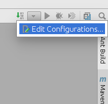
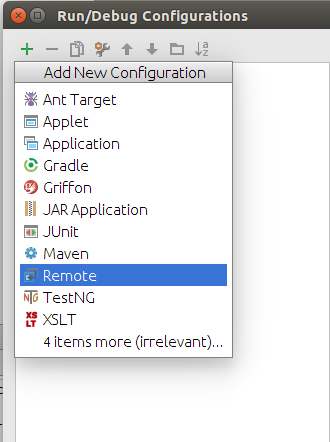
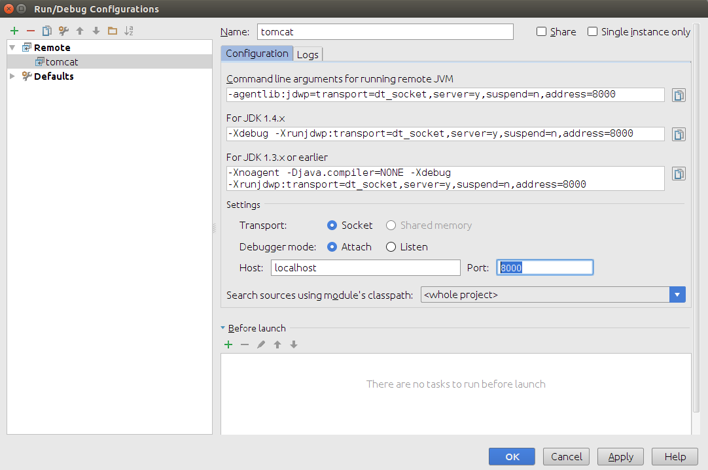
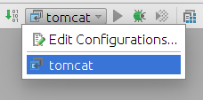
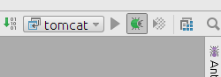
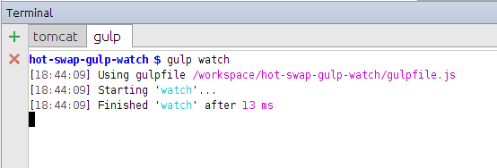

# Hot Swap e Gulp Watch

O Intellij Community não possui suporte a servidores web como o **Tomcat**.
Desta forma, é preciso iniciar o servidor pelo **terminal**.

O problema é que com isso perdemos o suporte do **Hot Swap** e do **Update automático** de resources. Ou seja, não podemos alterar código Java, JSP, HTML, CSS, JS e observar as alterações rapidamente no browser.

Uma forma de conseguir isso com o IntelliJ Community é usando 2 ferramentas:
- **Debug Remoto**: para Hot Swap de código Java
- **Gulp Watch**: para copiar resources alterados (JSP, HTML, CSS, JS) para a pasta do deploy.

## Ambiente
- IntelliJ Community
- Apache Tomcat
- Maven
- Java Servlets
- Gulp
- Linux

## Instalação

#### Clone
`git clone git@github.com:touchhealth/hot-swap-gulp-watch.git`

#### npm
`$ sudo apt-get install npm`

#### Gulp
`$ npm install --global gulp`

#### Maven
`$ sudo apt-get install maven`


## Dev

#### Importar projeto no Intellij

#### Build Maven
```
$ cd hot-swap-gulp-watch/
$ mvn clean install
```

#### Criar link simbólico da aplicação para o tomcat
```
$ cd apache-tomcat-VERSION/webapps/
$ ln -s WORKSPACE/hot-swap-gulp-watch/target/hot-swap-gulp-watch .

```

#### Subir tomcat em Debug
```
$ cd apache-tomcat-VERSION/
$ ./bin/catalina.sh jpda start

```

#### Acesse
`http://localhost:8080/hot-swap-gulp-watch/hello`

## Hot Swap

Para funcionar o Hot Swap Java, devemos criar uma Remote Configuration no IntelliJ escutando a porta 8000 e executá-la em debug.


#### Criar Remote Configuration no IntelliJ





**Altere a porta para 8000**




#### Conectar na JVM





#### Modificando código Java

O Hot Swap funciona apenas para alterações em **corpo de métodos**.
Ao alterar um método, faça `Ctrl+F9` para executar um `make` no IntelliJ. Com isso, ele irá compilar as classes alteradas e fará a substituição do `.class` no servidor.


## Watch resources

Para escutar alterações em JSP, HTML, CSS e JS e copiar os arquivos para o target, vamos usar o Gulp

```
$ cd hot-swap-gulp-watch/
$ gulp watch

```



Abra o arquivo [gulpfile](gulpfile.js) para mais detalhes.
